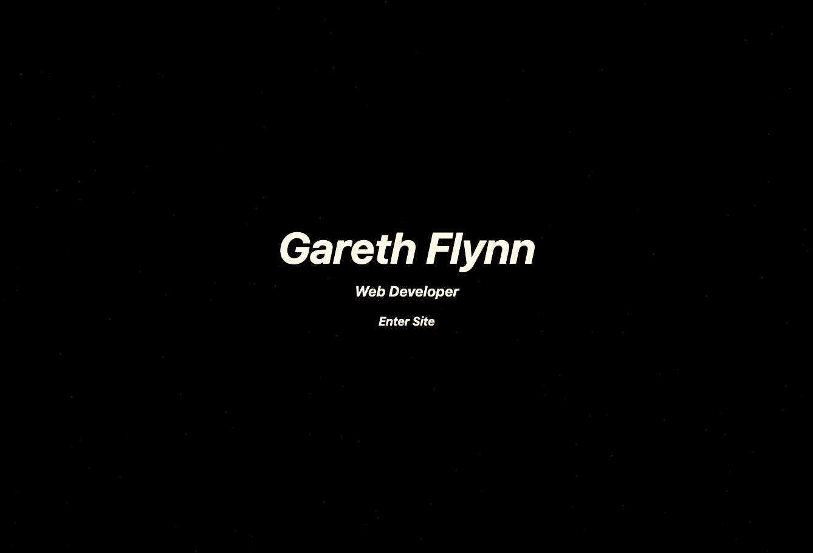

## Portfolio

The purpose of this application is to show a full stack web developer's portfolio.

## Table of Contents 

  * [Instalation](#installation)
  * [Screenshots/Visuals](#screenshots/visuals)
  * [Technology](#technology)
  * [License](#license)
  * [Questions](#questions)
  * [Credits](#credits)
  * [Links](#links)

## Installation 

No instalation necessary, just the Url.

## Screenshots/Visuals

## Technology

The technologies used for this application were: JavaScript, React, and various dependencies.

## License

[MIT](https://choosealicense.com/licenses/mit/)

## Questions 

If you have any questions please email me at gareth.t.flynn@gmail.com

## Credits

[@garethtflynn](https://www.github.com/garethtflynn) 

## Links  

* [Repository](https://github.com/garethtflynn/Portfolio)
* [Url]()